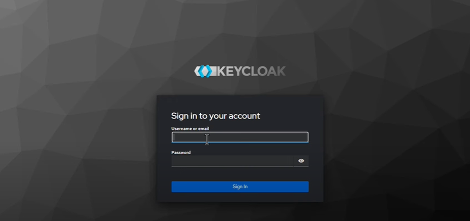
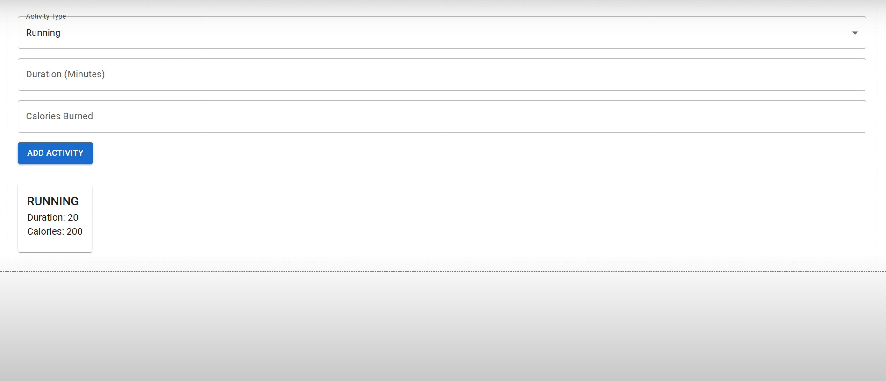
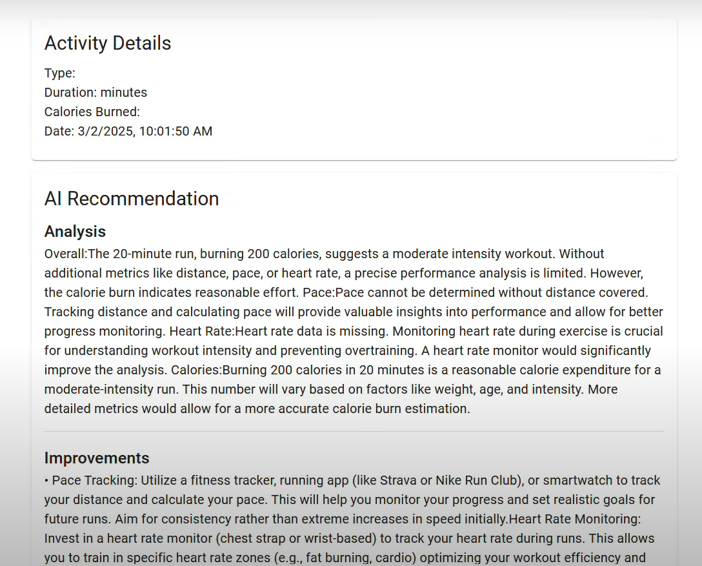
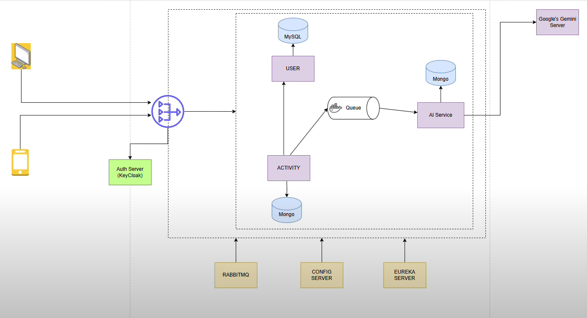

#  AI-Powered Fitness Tracker

An intelligent, full-stack fitness tracking application that enables users to log workouts and receive personalized AI-generated feedback. The system is built using a microservices architecture with Spring Boot, React, RabbitMQ, Keycloak, and Google Gemini API.

---

##  Features
-  Secure user authentication via **Keycloak**
- Log activities (e.g., running) with duration and calories
-  AI-generated analysis and suggestions using **Google Gemini API**
-  Asynchronous message queueing via **RabbitMQ**
-  Microservices registered via **Eureka**
-  Configuration management using **Spring Cloud Config**
-  Data stored in **MySQL** (User Service) and **MongoDB** (Activity & AI Services)

---

##  Project Screenshots

###  Login via Keycloak


###  Activity Form UI


###  AI Recommendation Panel


###  System Architecture Diagram


---

##  System Architecture

```
          +------------------+        +------------------+
          |   User Devices   |<-----> |    API Gateway   |
          +------------------+        +------------------+
                     |                          |
                     v                          v
           +------------------+       +------------------+
           |   Keycloak Auth  |       |   Activity Svc   |
           +------------------+       +------------------+
                                                |
                                                v
                              +---------------------------+
                              |        RabbitMQ Queue     |
                              +---------------------------+
                                                |
                                                v
                              +---------------------------+
                              |        AI Service         |
                              | Google Gemini + MongoDB   |
                              +---------------------------+
```

- **User Service**: Stores user data in MySQL  
- **Activity Service**: Stores activity data in MongoDB and sends data to AI Service via RabbitMQ  
- **AI Service**: Uses Gemini API to generate feedback and stores output in MongoDB  
- **Gateway**: Routes frontend requests to appropriate backend services  
- **Keycloak**: Handles login, tokens, and role-based access  
- **Eureka & Config Server**: Manage service discovery and configurations  

---

##  Tech Stack

| Layer         | Technologies                                       |
|---------------|----------------------------------------------------|
| Frontend      | React.js, Axios, Tailwind CSS                      |
| Backend       | Spring Boot, Spring Cloud, Spring Security         |
| Authentication| Keycloak                                           |
| Messaging     | RabbitMQ                                           |
| AI Service    | Google Gemini API                                  |
| Databases     | MySQL (User), MongoDB (Activity + AI)              |
| DevOps        | Docker, Docker Compose                             |
| Registry      | Eureka Server                                      |
| Config        | Spring Cloud Config Server                         |

---


## AI Recommendation Service

Once an activity is logged, it is sent to the AI Service using RabbitMQ. The AI Service:

- Retrieves and stores it in MongoDB
- Sends a prompt to Google Gemini API
- Parses and displays recommendations such as:
  - Calorie burn evaluation
  - Workout intensity
  - Suggestions to track pace, use heart rate monitor, etc.

---
